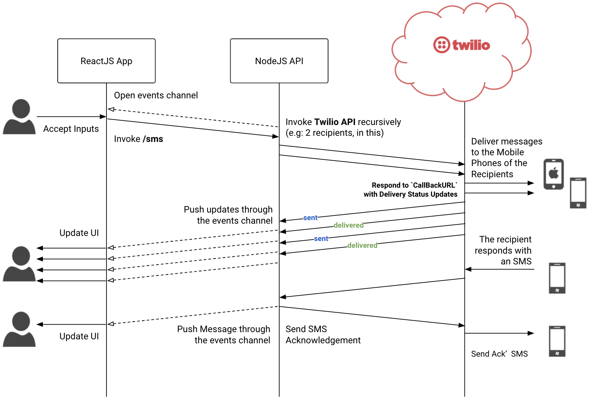

# Sending an SMS to a List of Recipients using Twilio
## This demo consists of 2 parts
1. Client API - `smsclientapi`, a NodeJS based backend service to proxy Twilio APIs for the application specific usage
2. Client App - `smsclient`, a ReactJS based web application
### Functionality
* The `smsclient` app takes a few inputs
    * A message to be delivered
    * A collection of phone numbers and names of the intended recepients
* The `smsclient` invokes `smsclientapi` (REST) to send the message to the intended recepients.
* The `smsclient` opens a Server-Sent-Events channel with the `smsclientapi` to obtain updates of the delivery statuses.
* `smsclientapi` invokes the respective Twilio API to deliver message. Then the Twilio API responds to (asnychronously) to the `smsclientapi` with the status of each message delivery.
* `smsclientapi` sends events to the `smsclient` based on the delivery status updates received from the Twilio Cloud
* `smsclient` updates the delivery status on its UI accordingly
* If any recepients responds to the message, the `smsclientapi` retrieves it through the Twilio Cloud and uses the same events channel to push that to the UI of `smsclient` app.

**The flow of communication:**

