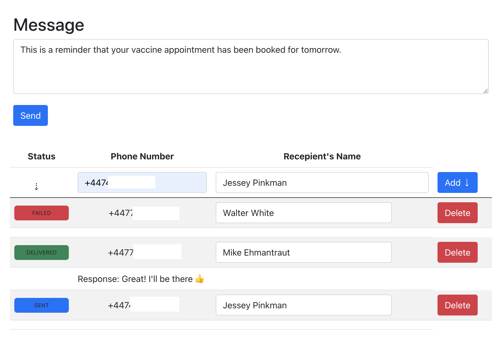

#### The User Interface of the Application:
----

---
1. Add/remove recepients.
2. Modify already added recipients' names.
3. Type a message and send it.
4. The `status` will be updated asynchronously at different times.
5. If one recipient responds, it will be displayed below that recipent on the list. ( Note the Response: `Great! I'll be there` ).